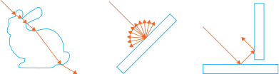

[](https://www.deepcode.ai/app/gh/Vertexwahn/FlatlandRT/_/dashboard?utm_content=gh%2FVertexwahn%2FFlatlandRT) [](https://vertexwahn.visualstudio.com/FlatlandRT/_build/latest?definitionId=6&branchName=master)

# FlatlandRT

[TOC]

## Description

FlatlandRT is a 2D ray tracer visualization tool.
See the [user manual](docs/user_manual.md) if you want to find out how to use it. 



More examples scene can be found [here](docs/example_scenes.md).

## Quick start

Flatland uses [Bazel](https://bazel.build/) as build system.

You can use FlatlandRT by invoking the following Bazel command.

*Render scene with Windows*

```bash
# When running Windows 10:
bazel run --config=windows10_x64 //srcs/flatland.cli:flatland C:\scenes\bunny.flatland.xml
```

*Render scene with Linux*

```bash
# When running Ubuntu 18.04
bazel run --config=ubuntu20_04_x64 //srcs/flatland.cli:flatland -- ~/Flatland/scenes/bunny.flatland.xml
```

## Building

### Building with Linux

#### Command line (bash/zsh)

```bash
# Run all tests
bazel test --config=ubuntu20_04_x64 //...
# Build all targets
bazel build --config=ubuntu20_04_x64 //... 
# Test using LLVM
bazel test --config=ubuntu20_04_x64_llvm --crosstool_top=@llvm_toolchain//:toolchain //...
```

#### CLion

There is a Bazel Plugin for CLion. It can be downloaded from [here](https://plugins.jetbrains.com/author/4bb31785-ad06-4671-8e26-266aadc184bd).

You can use the following `.bazelproject` file:

```yaml
directories:
  .

test_sources:
  tests

derive_targets_from_directories: true

additional_languages:
  python

build_flags:
  --config=ubuntu20_04_x64
```

#### Ubuntu 20 and LLVM

Bazel supports different toolchains. 
Usually gcc is used a C++ default compiler when using Ubuntu 20.
But you can also easily use LLVM to compile Flatland.

    # Build with LLVM
    bazel build --config=ubuntu20_04_x64_llvm --crosstool_top=@llvm_toolchain//:toolchain //...
    # Test with LLVM
    bazel test --config=ubuntu20_04_x64_llvm --crosstool_top=@llvm_toolchain//:toolchain //...

### Building with Windows

#### Command line (Powershell)

    # Build with Visual Studio 2019 C++ Compiler
    bazel build --config=windows10_x64 //...

#### Using Visual Studio 2019

Use [Lavender](https://github.com/tmandry/lavender) to generate a solution and project files for Visual Studio.

```bash
python3 D:\dev\lavender\generate.py --config=windows10_x64  //...
```

Lavender is far from being perfect. 
It might be necessary to do some modifications to the generated solution and project files.

## Coding process

I made a short video where I describe how I use test driven development to implement this project: 
[](https://www.youtube.com/watch?v=vFBXNr952nU)

## License

See (LICENSE.md)[LICENSE.md].

## Copyright notes

FlatlandRT makes use of several software libraries. 
Besides this, 
some source code was directly copied from other open-source software libraries or programs. 
This is always clearly stated as a comment in the source code of Flatland. 
The corresponding licenses can be found in the Licenses folder distributed with this source code:

### Copied source code/ideas

* Mitsuba Renderer 2 (https://github.com/mitsuba-renderer/mitsuba2) (scene file format) ([License](licenses/mitsuba2/LICENSE))
* Seurat (https://github.com/googlevr/seurat) (third party Bazel dependency for Eigen, i.e. eigen.BUILD) ([License](licenses/seurat/LICENSE))
* envoy (https://github.com/glasnostic/envoy) (third party Bazel dependency for tclap, i.e. tclap.BUILD)  ([License](licenses/envoy/LICENSE))
* pbrt, Version 3 (https://github.com/mmp/pbrt-v3) (Refract, Faceforward functions) ([License](licenses/pbrt-v3/LICENSE.txt))
* pbrt, Version 4 (https://github.com/mmp/pbrt-v4) (concentric sampling of unit disk) ([License](licenses/pbrt-v4/LICENSE.txt))

### Build related

* LLVM toolchain for Bazel (https://github.com/grailbio/bazel-toolchain) (building Flatland with LLVM) ([License](licenses/llvm_bazel_toolchain/LICENSE))

### Third party dependencies

* {fmt} (https://github.com/fmtlib/fmt) (third party dependency) ([License](licenses/fmt/LICENSE.rst))
* Boost (https://www.boost.org/) (third party dependency) ([License](licenses/boost/LICENSE))
* catch2 (https://github.com/catchorg/Catch2) (third party dependency) ([License](licenses/catch2/LICENSE.txt))
* gflags (https://github.com/gflags/gflags/) (third party dependency) ([License](licenses/gflags/COPYING.txt))
* glog (https://github.com/google/glog) (third party dependency) ([License](licenses/glog/COPYING))
* Google Test (https://github.com/google/googletest) (third party dependency) ([License](licenses/googletest/LICENSE))
* hypothesis (https://github.com/wjakob/hypothesis) (third party dependency) ([License](licenses/hypothesis/LICENSE))
* pcg-cpp (https://github.com/imneme/pcg-cpp/)  (third party dependency) ([License](licenses/pcg-cpp/LICENSE-MIT.txt))
* pugixml (https://pugixml.org/, https://github.com/zeux/pugixml) (third party dependency) ([License](licenses/pugixml/LICENSE.md))
* TCLAP - Templatized Command Line Argument Parser (https://github.com/mirror/tclap) ([License](licenses/tclap/COPYING))
* yaml-cpp (https://github.com/jbeder/yaml-cpp) (third party dependency) ([License](licenses/yaml-cpp/LICENSE))

### Artwork

The Stanford Bunny was derived from the Stanford Bunny provided here: http://graphics.stanford.edu/data/3Dscanrep/#bunny)
