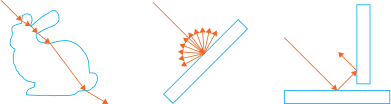

<!--
SPDX-FileCopyrightText: Copyright 2022-2023 Julian Amann <dev@vertexwahn.de>
SPDX-License-Identifier: Apache-2.0
-->

[](https://opensource.fb.com/support-ukraine)
[](https://vertexwahn.visualstudio.com/FlatlandRT/_build/latest?definitionId=6&branchName=master)

# FlatlandRT

## Description

FlatlandRT is a 2D ray tracer visualization tool.
The following pictures were created using FlatlandRT:

From left to right: Refraction, ambient occlusion and reflection:



Quadtree intersection of 2D triangle meshes:


More examples scenes can be found [here](devertexwahn/flatland/docs/example_scenes.md).
See the [user manual](devertexwahn/flatland/docs/user_manual.md) if you want to find out how to use it. 

## Quick start

This project uses [Bazel](https://bazel.build/) as a build system.
The current used version is defined in [.bazelversion](devertexwahn/.bazelversion).

**Prerequisites:**

The following tools should be installed:

* [Git](https://git-scm.com/)
* [Bazel](https://bazel.build/install)
* A C++ compiler ([GCC](https://gcc.gnu.org/), [Visual Studio](https://visualstudio.microsoft.com/), [Clang](https://clang.llvm.org/), etc.)

**Checkout, build, and run:**

You can use Flatland by invoking the following commands:

*All platforms:*

```shell
git clone https://github.com/Vertexwahn/FlatlandRT # clone the repository
cd FlatlandRT # change directory to cloned repository
cd devertexwahn # switch to the location where the MODULE.bazel file is located
```

*Render a scene with Windows 10/11 x64 with Visual Studio 2019:*

```shell
bazel --output_base=C:/bazel_output_base  run --config=vs2019 //flatland/cli:flatland.cli --scene_filename=C:\scenes\bunny.flatland.xml
```

*Render a scene with Windows 10/11 x64 with Visual Studio 2022:*

```shell
bazel --output_base=C:/bazel_output_base  run --config=vs2022 //flatland/cli:flatland.cli --scene_filename=C:\scenes\bunny.flatland.xml
```

For more hints on how to use Bazel on Windows have a look at the [Bazel on Windows](https://docs.google.com/document/d/17YIqUdffxpwcKP-0whHM6TFELN8VohTpjiiEIbbRfts/edit?usp=sharing) document.

*Render a scene with Ubuntu 20.04:*

```shell
bazel run --config=gcc9 //flatland/cli:flatland.cli -- --scene_filename=$(pwd)/flatland/scenes/bunny/bunny.flatland.xml
```

*Render a scene with Ubuntu 22.04:*

```shell
bazel run --config=gcc11 //flatland/cli:flatland.cli -- --scene_filename=$(pwd)/flatland/scenes/bunny/bunny.flatland.xml
```

*Render a scene with macOS 11/12/13:*

```shell
bazel run --config=macos //flatland/cli:flatland.cli -- --scene_filename=$(pwd)/flatland/scenes/bunny/bunny.flatland.xml
```

## Building & Testing

### Building and testing with Linux

#### Command line (bash/zsh)

```shell
# Run all tests using GCC 9.3
bazel test --config=gcc9 //...
# Build all targets uing GCC 9.3
bazel build --config=gcc9 //... 
# Run all tests using GCC 11
bazel test --config=gcc11 //...
# Build all targets uing GCC 11
bazel build --config=gcc11 //...
# Run all tests using Clang 14
bazel test --config=clang14 //...
# Build all targets uing Clang 14
bazel build --config=clang14 //...
```

#### CLion

There is a Bazel plug-in for CLion.
It can be downloaded from [here](https://plugins.jetbrains.com/author/4bb31785-ad06-4671-8e26-266aadc184bd).

You can use the following `.bazelproject` file:

```yaml
directories:
  .

test_sources:
  flatland/tests

derive_targets_from_directories: true

additional_languages:
  python

build_flags:
  --config=gcc11
```

#### Code coverage

Make sure that lcov is installed.

```shell
sudo apt install lcov
```

Go to the directory that contains the `MODULE.bazel` file and execute:

```shell
./coverage.sh --additonal_bazel_config=buchgr_remote_cache
open coverage_report/index.html
```

#### Address Sanitizer

There is a build config called `asan` that can be used for detecting memory errors.

```shell
bazel run --config=asan --compilation_mode=opt //flatland/cli:flatland.cli --  $(pwd)/flatland/scenes/sphere.flatland.xml
```

#### Clang Tidy

```shell
bazel build --config=clang-tidy //flatland/core/...
```

### Building with Windows

#### Command line (Powershell)

```shell
# Build with Visual Studio C++ Compiler
bazel build --config=vs2022 //...
```

#### Using Visual Studio

Use [Lavender](https://github.com/tmandry/lavender) to generate a solution and project files for Visual Studio.

```shell
python3 G:\dev\lavender\generate.py --config=vs2022  //...
```

Lavender is far from being perfect.
It might be necessary to do some modifications to the generated solution and project files.

## Development process

I made a short video where I describe how I use test driven development to implement this project:
[](https://www.youtube.com/watch?v=vFBXNr952nU)

## Ray tracing 101

I have written some blog post about ray tracing that can be found here: [Ray Tracing 101](https://book.vertexwahn.de/)

## License

The source code of FlatlandRT itself is under the Apache License 2.0 (see [LICENSE](LICENSE)).
The license of its third-party dependencies or some third-party code fragments can and is under different license terms.
See copyright notes in the next section.

## Copyright notes

FlatlandRT makes use of several software libraries.
Some tools and libraries were copied to this repository (see `third_party` folder).
The corresponding licenses can be found in the `third_party` folder of this repository.
Besides this,
some source code was directly copied from other open-source software libraries or programs.
This is always clearly stated as a comment in the source code of FlatlandRT.
If you find any copyright or license violations or issues please let me know.

### Copied source code/ideas

* Mitsuba Renderer 2 (https://github.com/mitsuba-renderer/mitsuba2) (scene file format) ([License](devertexwahn/flatland/LICENSES/mitsuba2/LICENSE))
* pbrt, Version 3 (https://github.com/mmp/pbrt-v3) (Refract, face_forward functions) ([License](devertexwahn/flatland/LICENSES/pbrt-v3/LICENSE.txt))
* pbrt, Version 4 (https://github.com/mmp/pbrt-v4) (concentric sampling of unit disk) ([License](devertexwahn/flatland/LICENSES/pbrt-v4/LICENSE.txt))
* bazel_clang_tidy (https://github.com/erenon/bazel_clang_tidy) (almost everything) ([License](devertexwahn/flatland/LICENSES/bazel_clang_tidy/LICENSE))

### Build related

* LLVM toolchain for Bazel (https://github.com/grailbio/bazel-toolchain) (building Flatland with LLVM) ([License](licenses/llvm_bazel_toolchain/LICENSE))

### Third-party dependencies

* Boost (https://www.boost.org/) (third party dependency) ([License](devertexwahn/flatland/LICENSES/boost/LICENSE))
* Catch2 (https://github.com/catchorg/Catch2) (see `third_party` folder)
* Eigen (see `third_party` folder)
* Google Test (https://github.com/google/googletest) (see `third_party` folder)
* Imath (see `third_party` folder)
* LLVM toolchain for Bazel (see `third_party` folder)
* [OpenEXR](/third_party/openexr) (https://github.com/AcademySoftwareFoundation/openexr) ([License](/third_party/openexr/LICENSE.md))
* [libpng](/third_party/libpng-1.6.40) (http://www.libpng.org/pub/png/libpng.html) ([License](/third_party/libpng-1.6.40/LICENSE))
* [pcg-cpp](/third_party/pcg-cpp) (https://github.com/imneme/pcg-cpp/)
* [pugixml](/third_party/pugixml-1.13) (https://pugixml.org/, https://github.com/zeux/pugixml)
* [rules_boost](/third_party/rules_boost) (https://github.com/nelhage/rules_boost) ([License](/third_party/rules_boost/LICENSE))
* [rules_pkg-0.9.1](/third_party/rules_pkg)
* abseil (https://abseil.io/) (see `third_party` folder)
* gflags (https://github.com/gflags/gflags/) (see `third_party` folder)
* glog (https://github.com/google/glog) (see `third_party` folder)
* hypothesis (https://github.com/wjakob/hypothesis) (see `third_party` folder)
* yaml-cpp (https://github.com/jbeder/yaml-cpp) (third party dependency) ([License](devertexwahn/flatland/LICENSES/yaml-cpp/LICENSE))
* zlib (https://zlib.net/) ([License](devertexwahn/flatland/LICENSES/third_party/zlib-1.2.11/README))
* {fmt} (https://github.com/fmtlib/fmt) (see `third_party` folder)

### Artwork

The Stanford Bunny was derived from the Stanford Bunny provided from the Stanford 3D Scanning Repository (see [here](http://graphics.stanford.edu/data/3Dscanrep/#bunny)).

The data for the Donut, Armadillo, and Stanford Bunny for the 2D triangle data was derived from https://github.com/mmacklin/sandbox.

### Credits

A big thank goes to all the providers, developers, and maintainers of the aforementioned open-source projects and artifacts.
