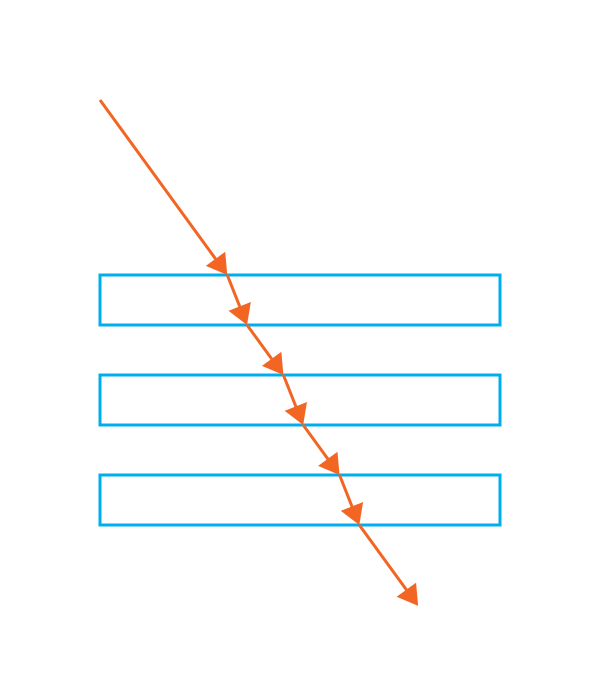

<!--
SPDX-FileCopyrightText: 2022 Julian Amann <dev@vertexwahn.de>
SPDX-License-Identifier: Apache-2.0
-->
# Example Scenes

## Refraction

### bunny.flatland.xml

### disk.flatland.xml

### disk_grid.flatland.xml

### rectangle.flatland.xml

### rectangles.flatland.xml

### gradient_refractive_index.flatland.xml

## Reflection

### mirror.flatland.xml

### mirrors.flatland.xml

## Ambient Occlusion

### ao.flatland.xml

### bunny.ao.flatland.xml

### disk.ao.flatland.xml

