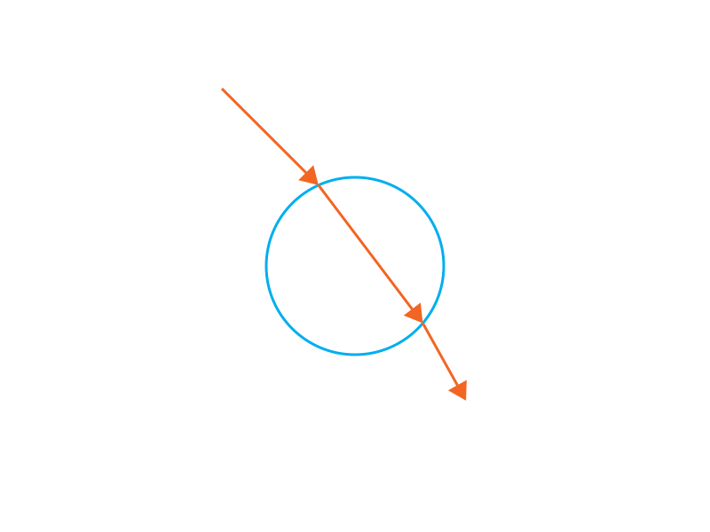
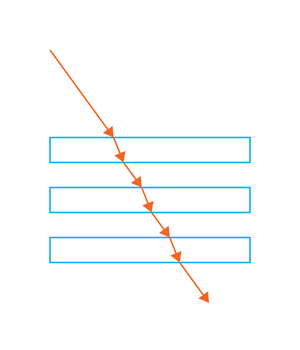
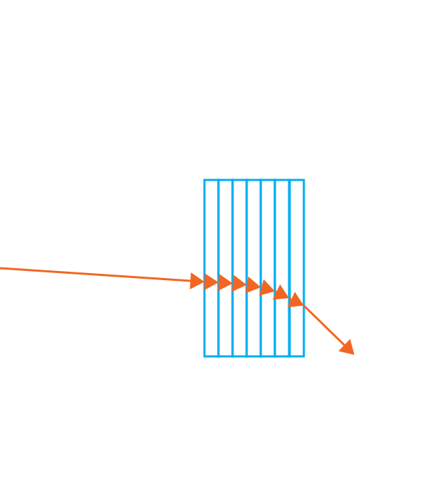
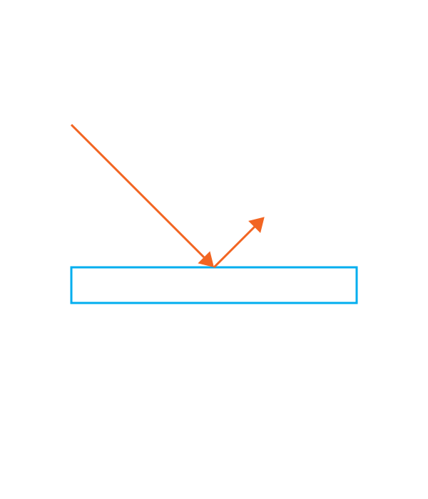
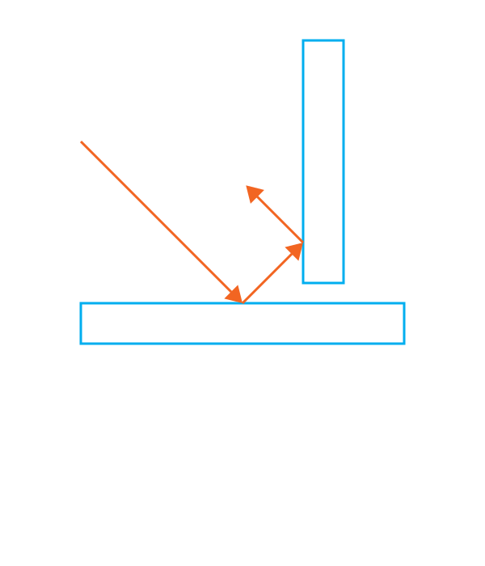

# Example Scenes

[TOC]

## Refractions

### bunny.flatland.xml

### disk.flatland.xml

### rectangle.flatland.xml

### rectangles.flatland.xml

### gradient_refractive_index.flatland.xml

### mirror.flatland.xml

### mirrors.flatland.xml

