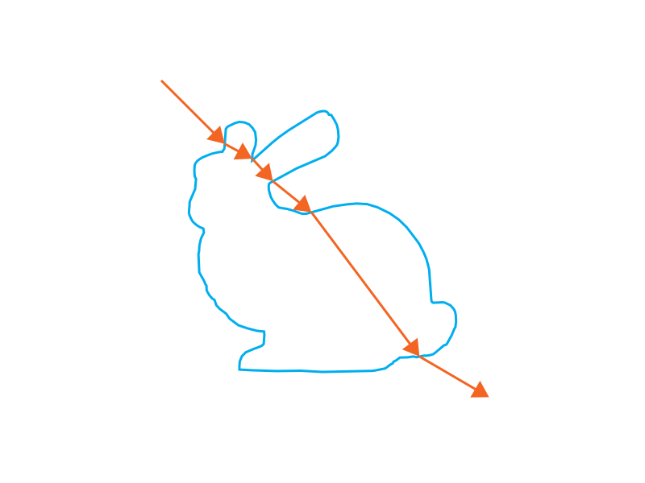

# Flatland

[TOC]

## User manual

### About

Flatland is a 2D toy ray tracer. It expects a scene file as an input and generates a Scalable Vector Graphics (SVG) as an output.

Given this scene file:

```xml
<?xml version="1.0" encoding="UTF-8"?>
<scene>
    <camera>
        <film width="800" height="600" filename="out.svg"></film>

        <transform>
            <lookAt origin="200, 500" target="400, 300" />
        </transform>
    </camera>

    <integrator type="path">
        <integer name="max_depth" value="1"/>
    </integrator>

    <shape type="polygon">
        <transform>
            <scale x="3" y="3" />
            <translate x="400" y="300" />
        </transform>

        <string name="filename" value="bunny_coords.ply"/>

        <material>
            <color name="stroke_color" value="0.0, 0.682, 0.937" />
            <float name="stroke_width" value="3.0" />
            <color name="fill_color" value="1.0, 1.0, 1.0" />
        </material>
    </shape>
</scene>
```

This output is generated:



### Command-Line Reference

```bash
flatland <filename.scene.xml>
```

### Scene file format

The scene file format is heavily influence by the scene format used by [Mitsuba 2](https://mitsuba2.readthedocs.io/en/latest/src/getting_started/file_format.html) and [Nori](https://github.com/wjakob/nori).
